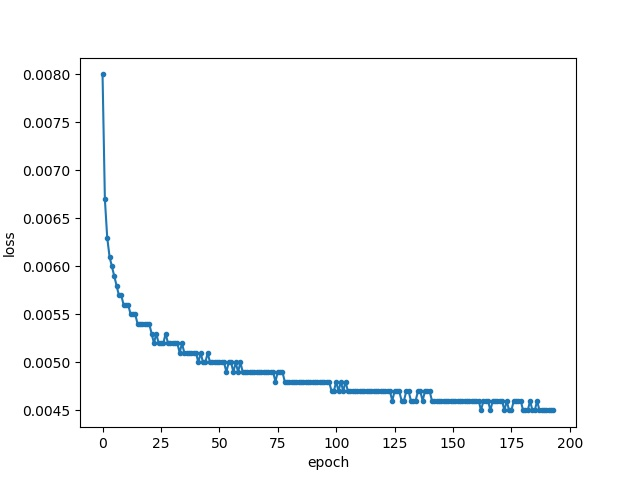

# SAR-Voxelmoph-Registration
#### Voxelmorph无监督图像配准说明

##### **简介**

​	基于Voxelmoph（https://github.com/voxelmorph/voxelmorph)的无监督SAR图片配准。对于同一场景不同波段或入射角度获取SAR图像进行变形配准。网络结构可选择voxelmorph代码包networks里面的模型，默认使用unet-core基础模型。原理参考论文：**VoxelMorph: A Learning Framework for Deformable Medical Image Registration**

##### **安装依赖库**

1. Tensoflow-1.14.0
2. keras-2.1.5
3. PIL
4. Opencv-python
5. Matplotlib
6. Pickle

##### **训练**

1. 数据：无监督训练，只需要准备图像对，即基准图像和待配准图像，放到不同的文件夹。需要分别生成图片的路径txt用于训练，验证，测试。

    train_fixed.txt, train_moving.txt   分别是用于训练的基准图像和待配准图像，数量相同

    val_fixed.txt, val_moving.txt. 用于训练时验证的基准图和待配准图

2. 运行mydata_train.py,

    可自定义：

    --model_dir 模型保存路径

    --gpu 自定义GPU

    --lr  学习率

    --epochs   训练集循环次数

    --img_size  训练图片大小

    --ambda_param   损失函数权重，MSE损失默认使用0.01

    --steps_per_epoch    根据bats_szie和训练集大小调整，计算方式为：训练样本数量/batch_size

    -- batch_size 批训练大小

    命令行运行：mydata_train.py /my/path/to/train_fixed.txt /my/path/to/train_moving.txt  /my/path/to/val_fixed.txt /my/path/to/val_moving.txt --gpu 0 --model_dir /my/path/to/save/models 

    --img_size image size -- batch_size 16 --steps_per_epoch 488

3. 训练监控训练时loss，默认每五个epoch保存模型可在源码中调整

##### **测试**

运行my data_test.py

1. --root_dir 测试结果保存路径
2. --fixed_dir   基准图像放置文件夹地址，将要配准的基准图像放在该路径下面
3. --moving_dir 待配准图像放置文件夹地址，将待配准图像放在该路径下面
4. --model_dir 加载训练好的权重，传递模型路径
5. --img_size 测试图片大小，可以自定义，不用和训练时一致

配准图示例：

流场可视化图：

##### **训练过程曲线**

训练完自动保存训练losss数据SAR_model_hist.pickle，可直接运行plot_loss_curve，绘制训练总损失，验证损失，相似性损失，流场损失等。

总Loss:

总Val_loss:

相似性loss：

验证：

流场损失：

验证流场损失：

##### **比较配准前后结构相似性**

运行SSAIM.py ,传递用于测试的基准图和待配准图路径txt文件，模型将会比较每一个样本配准前后结构相似性。

